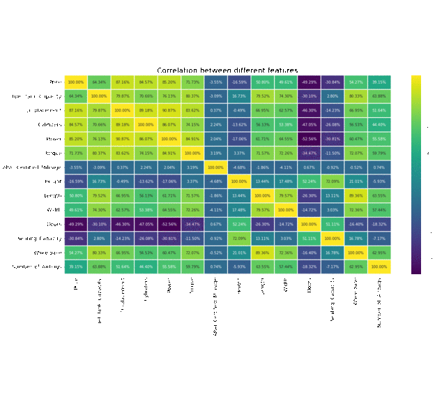

# Data Insider: Analysis of Cars in Indian Market
## Introduction
This project involves analysis of cars sold in indian market.
## Data Insights from the analysis

## Requirements
- Python
- Jupyter notebook
- NumPy
- Matplotlib
- Seaborn

## Dataset
- Kaggle Indian car sales dataset containing around 1300 different car models and variants from multiple car manufacturers

## Data Preprocessing
- Null values removal and estimation
- Select required columns
- Convert to Numerical values (Integers)
- Categorical values - One hot encoding

## Data Visualization
### Some Insights
### Average Price distribution for each body type of car

### Correlation

### Power distribution of cars sold
